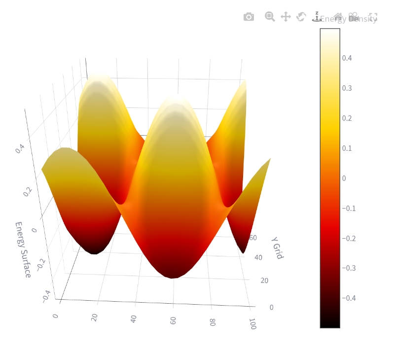
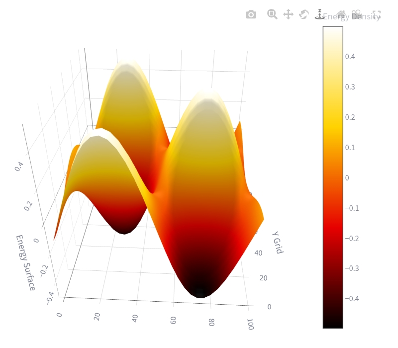
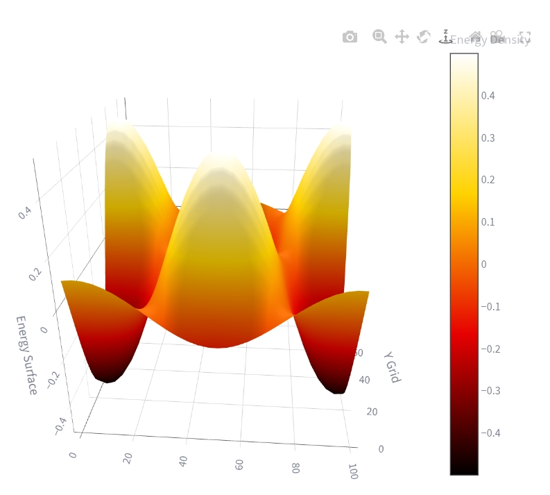
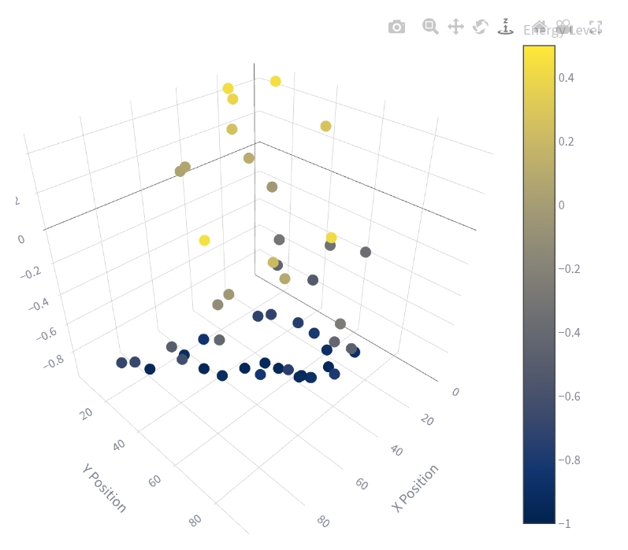
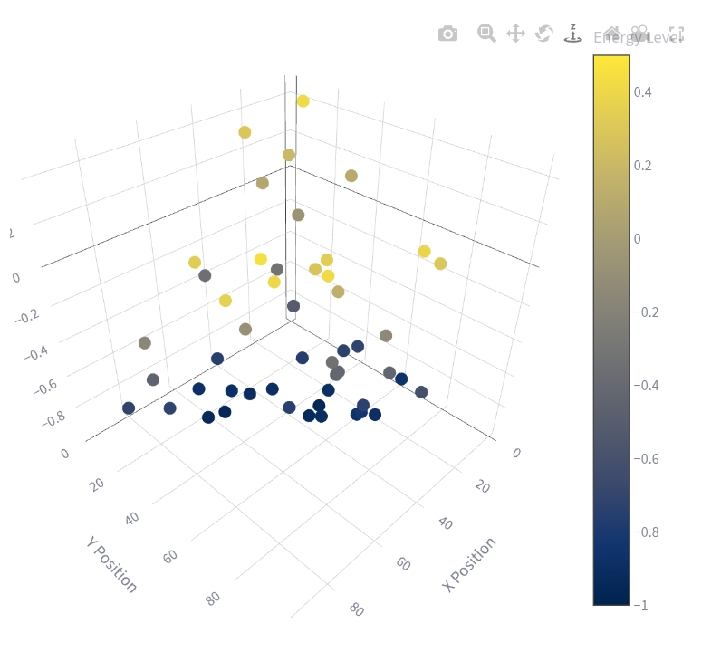
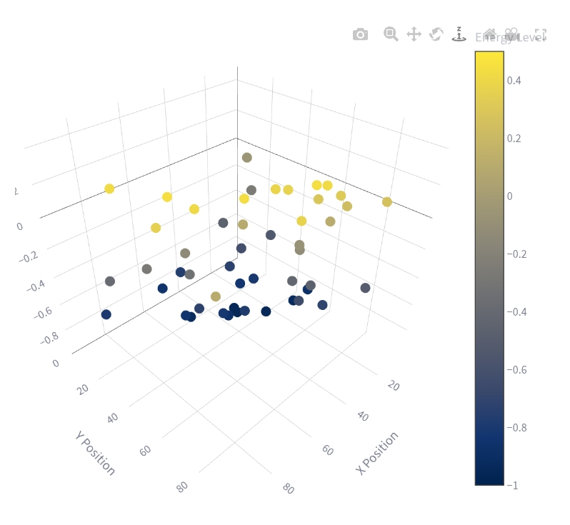

<div align="center">

# 🧠 Cognitive-Multi-Agent-Sim

[](#)
[](#)
[](#)
[](#)

*A production-grade, hybrid simulation framework analyzing the limits of Deep RL in modeling human cognitive complexity.*

</div>

---

## 🎯 About The Project
This project is a custom-built, dynamic simulation environment where multiple AI entities (agents) learn to coordinate, plan complex tasks, and survive—**entirely without human instruction.** 

Using Deep Reinforcement Learning (DRL), this simulation forces agents to figure out resource collection, survival strategies, and cooperative/competitive behaviors from scratch in a dynamic world.

## 🚀 The Core Philosophy & Research Vision
While standard Reinforcement Learning (RL) algorithms perform exceptionally well in isolated environments, they often experience extreme instability and non-stationarity when multiple autonomous minds interact simultaneously. 

**Our primary objective is to expose and analyze the architectural limitations of pure mathematical Reinforcement Learning in replicating human-like decision-making.** 

This simulation proves that mathematical reward maximization alone is insufficient for complex multi-agent ecosystems. To bridge the gap between artificial execution and human cognitive traits, systems must model strategic hesitation, intentionality (Theory of Mind), and cognitive biases rather than relying solely on raw numerical optimization.

## 🔬 Core Research Areas
- **Multi-Agent Coordination:** Observing how agents interact, collaborate, or compete for limited resources.
- **Cognitive Complexity & Non-Stationarity:** Examining why standard DRL frameworks degrade or fluctuate as agent strategy co-evolves.
- **High-Speed Environment Modeling:** Designing a memory-contiguous simulation engine capable of microsecond state changes.
- **Theory of Mind Estimation:** Teaching agents to dynamically predict the intent and paths of competing entities.

## 💻 Tech Stack & Architecture
This repository implements a highly optimized, production-grade hybrid ecosystem:
- **Python & PyTorch** 🔥 (Deep Q-Networks & Cognitive Logic Processing)
- **Gymnasium** 🏋️‍♂️ (Custom Multi-Agent Environment Wrappers)
- **C++ Engine** ⚙️ (High-performance environment compilation linked via `pybind11` for maximum execution speed)
- **Go / Golang Gateway** 🐹 (Asynchronous, high-throughput network service for streaming and logging real-time agent telemetry)

---

## 📊 Live Telemetry & Simulation Dashboards

Below are the visual telemetry dashboards tracking non-stationary decision trajectories, phase portraits, system memory overhead, and cognitive friction during execution spikes:

<div align="center">

### 🟢 3D Surface & Topography Exploration
<table>
  <tr>
    <td align="center" width="50%">
      <br/>
      <b>Mount 1 Trajectory</b>
    </td>
    <td align="center" width="50%">
      <br/>
      <b>Mount 2 Analysis</b>
    </td>
  </tr>
  <tr>
    <td align="center" width="50%">
      <br/>
      <b>Mount 3 Dynamics</b>
    </td>
    <td align="center" width="50%">
      <br/>
      <b>3D Space Exploration</b>
    </td>
  </tr>
  <tr>
    <td align="center" width="50%">
      <br/>
      <b>3D Energy Surface</b>
    </td>
    <td align="center" width="50%">
      <br/>
      <b>3D State Trajectory</b>
    </td>
  </tr>
</table>

### 📈 Cognitive Dynamics & Execution Metrics
<table>
  <tr>
    <td align="center" width="50%">
      <br/>
      <b>High-Fidelity State Space Matrix</b>
    </td>
    <td align="center" width="50%">
      <br/>
      <b>Cognitive Friction vs Stream Latency</b>
    </td>
  </tr>
  <tr>
    <td align="center" width="50%">
      <br/>
      <b>Non-Stationarity Strategy Drift Matrix</b>
    </td>
    <td align="center" width="50%">
      <br/>
      <b>Strategy Convergence Phase Portrait</b>
    </td>
  </tr>
  <tr>
    <td align="center" width="50%">
      <br/>
      <b>Dynamic System Memory Overhead</b>
    </td>
    <td align="center" width="50%">
      <br/>
      <b>Pareto Efficiency Optimization Frontier</b>
    </td>
  </tr>
  <tr>
    <td align="center" width="50%">
      <br/>
      <b>Telemetry Channel Packet Loss</b>
    </td>
    <td align="center" width="50%">
      <br/>
      <b>Neural Policy Entropy Decay</b>
    </td>
  </tr>
</table>

</div>

---

## 🚧 Current Status
* **Hybrid Core:** Completed! The Python training architecture, C++ physics layer, and Go telemetry gateway are fully integrated.
* **CI/CD Pipeline:** Automated integration testing via GitHub Actions is live (ensuring every commit maintains structural integrity).

---

## 🔧 Build Troubleshooting

The C++ backend is built using **pybind11**. If you encounter build errors, check that your compiler and dependencies are installed correctly.

### Compiler Requirements

| Platform | Compiler |
|----------|----------|
| Linux | GCC (g++) |
| macOS | Apple Clang |
| Windows | Microsoft Visual Studio Build Tools (MSVC) |

Install all required Python dependencies before building:

```bash
make init
```

This installs the required packages, including:

- torch
- numpy
- gymnasium
- pybind11
- requests

---

### Building the C++ Backend

Compile the backend using:

```bash
make build-backend
```

This runs:

```bash
python setup.py build_ext --inplace
```

The command compiles `bindings.cpp` into the `physics_core` Python extension, allowing it to be imported directly by the simulator.

---

### Common Build Issues

#### `ModuleNotFoundError: No module named 'pybind11'`

Install the missing dependency:

```bash
pip install pybind11
```

or simply run:

```bash
make init
```

---

#### `fatal error: pybind11/pybind11.h: No such file or directory`

Ensure `pybind11` is installed in your current Python environment:

```bash
pip install pybind11
```

---

#### `Python.h: No such file or directory`

On Ubuntu/Debian, install the Python development headers:

```bash
sudo apt install python3-dev
```

Then rebuild:

```bash
make build-backend
```

---

#### Compiler not found

**Linux**

```bash
sudo apt install build-essential
```

**macOS**

```bash
xcode-select --install
```

**Windows**

Install **Visual Studio Build Tools** with:

- MSVC C++ Compiler
- Windows SDK

Restart your terminal after installation and rebuild the project.

---

### Cleaning Previous Builds

If the build fails after changing dependencies or source files, clean previous build artifacts and rebuild:

```bash
make clean
make build-backend
```

This removes compiled binaries and build files before performing a fresh build.

---

### 🤝 Support & Follow
Are you fascinated by Artificial General Intelligence (AGI), Multi-Agent Systems, or the limitations of Deep RL in modeling cognitive behavior? 

**Please consider giving this repository a ⭐ STAR!** It helps the project grow and tracks our development journey!

Don't forget to **[Follow me on GitHub](https://github.com/Asmit-Singh-01)** to stay updated as we publish training logs, data graphs, and architectural updates. Let's push the boundaries of AI together! 🌍🤖
