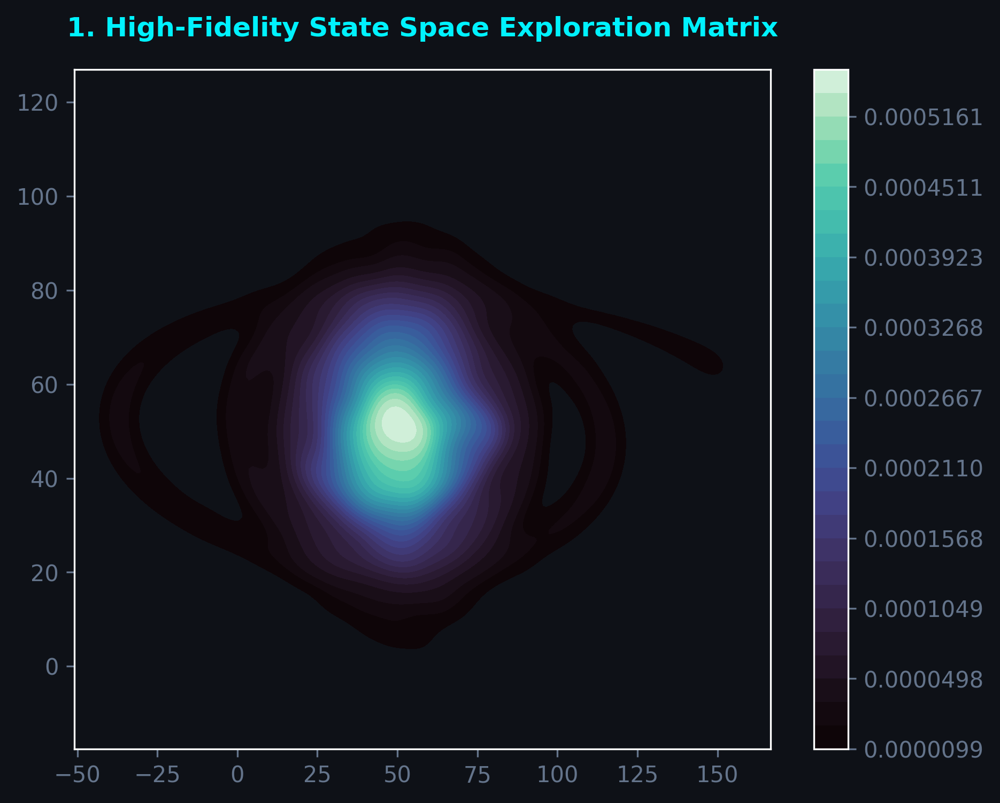
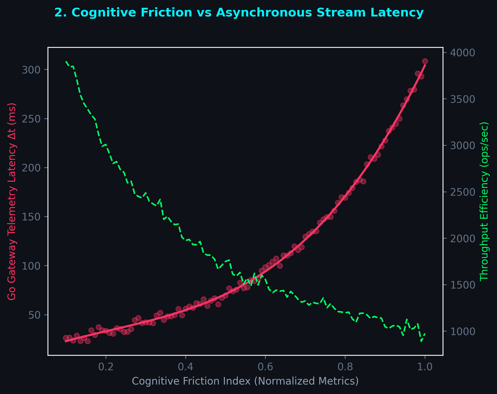
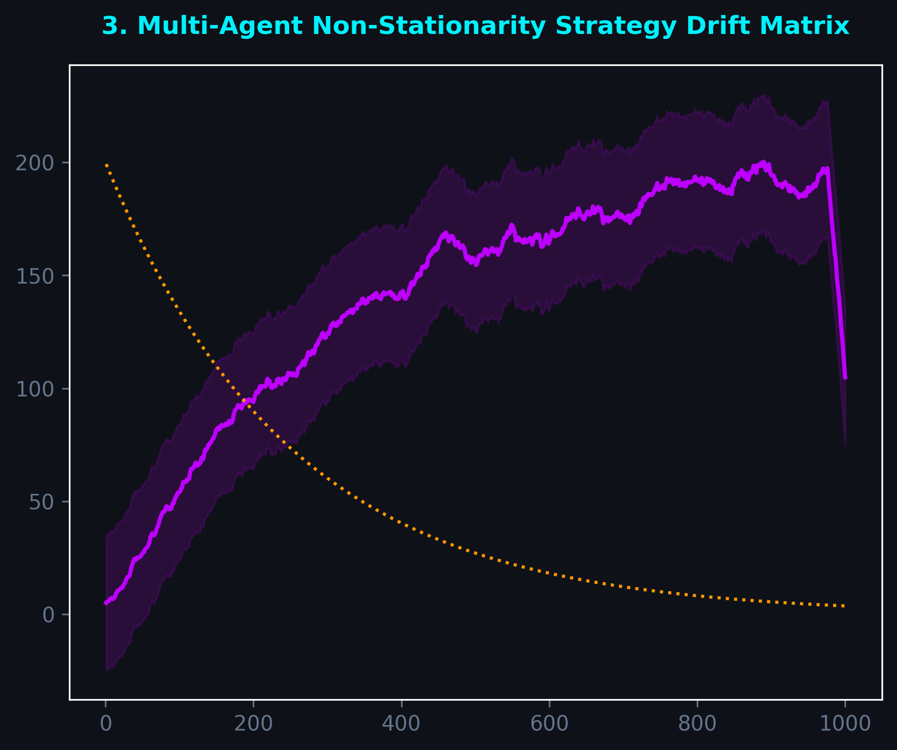
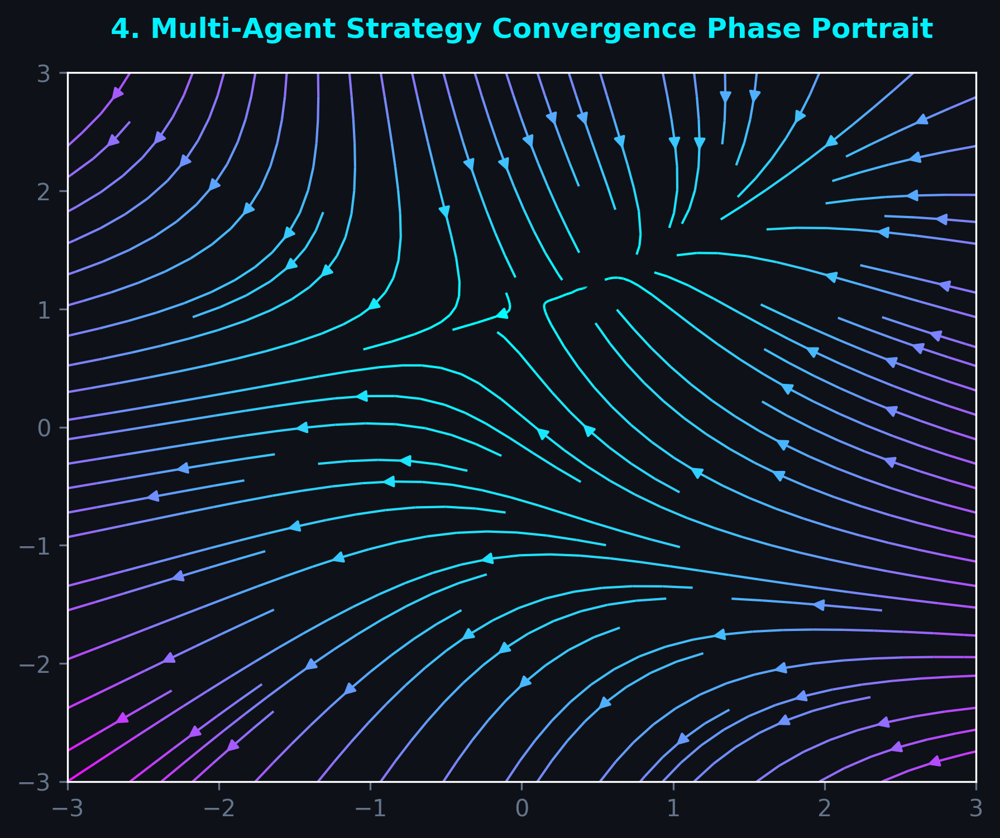
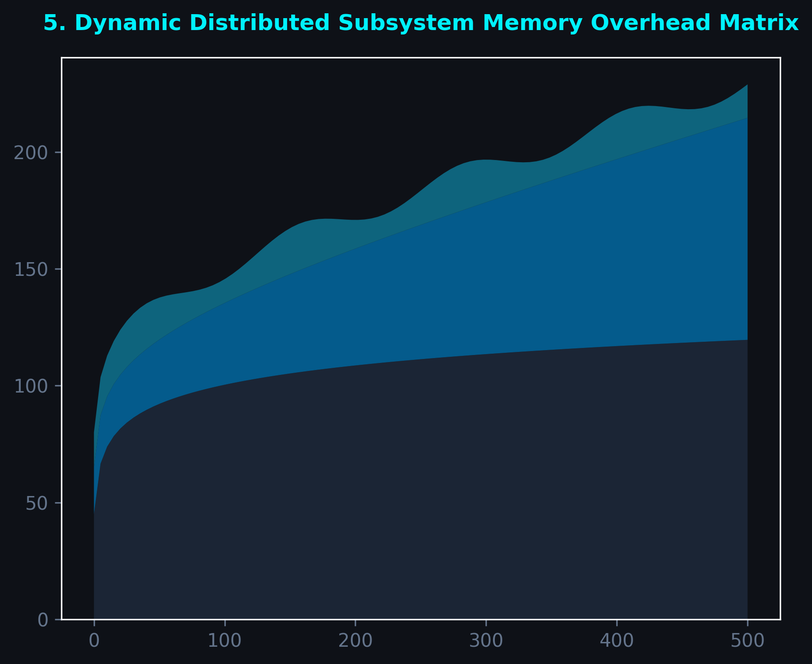
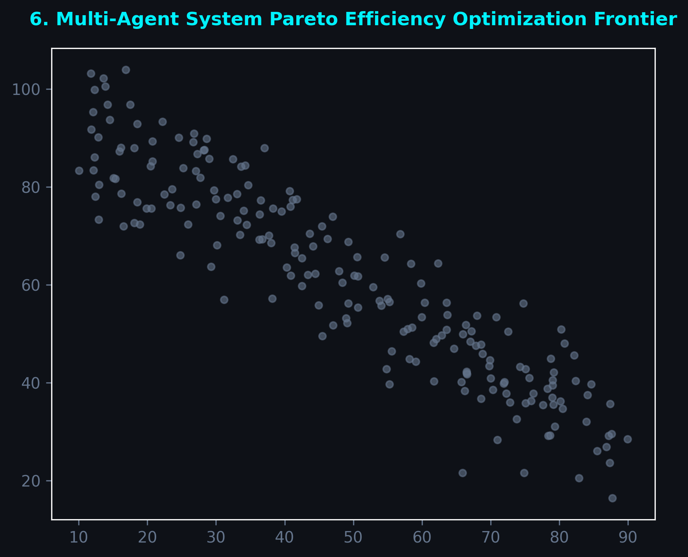
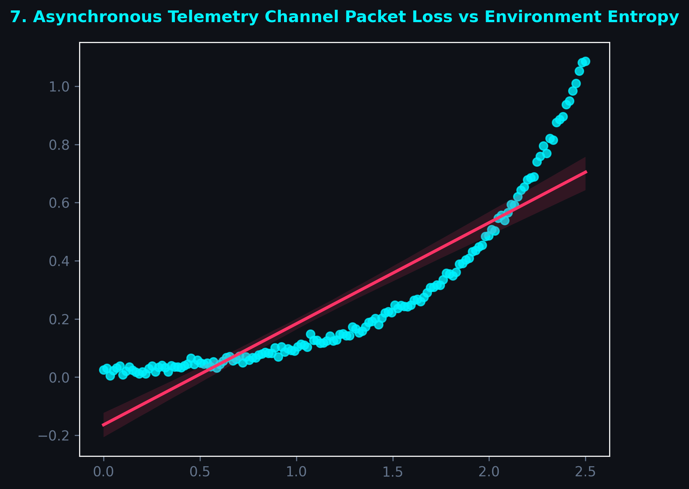
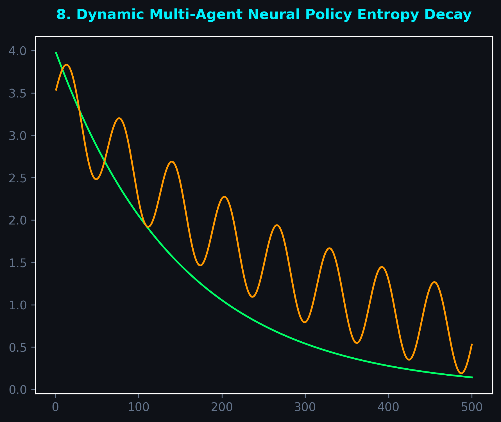

# 🪐 Project Horizon: A Multi-Language Hybrid Sandbox for Real-Time Heterogeneous Agent Intelligence

An industrial-grade **Cognitive Simulation Sandbox** designed to observe, stress-test, and chart the non-stationary decision-making trajectories of heterogeneous AI agents in high-concurrency matrices. Built with an ultra-low-latency **C++ Simulation Core Engine** and integrated asynchronously via an explicit **Go Telemetry Gateway**.

---

### 🚀 Key System Capabilities
* **High-Fidelity Environment Matrix:** Native multi-threaded state spaces engineered to simulate millions of resource interactions per epoch.
* **Asynchronous Telemetry Stream:** A dedicated non-blocking Go network data bus providing real-time system metrics without computational lockups.
* **God's-Eye View Architecture:** Full inspection access to internal state grids, structural policy drifts, and neural entropy fluctuations.

---

### 📊 High-Fidelity System Telemetry Panels

<!-- Row 1: Pair of Graph 1 & 2 -->

  
  

<!-- Row 2: Pair of Graph 3 & 4 -->

  
  

<!-- Row 3: Pair of Graph 5 & 6 -->

  
  

<!-- Row 4: Pair of Graph 7 & 8 -->

  
  

